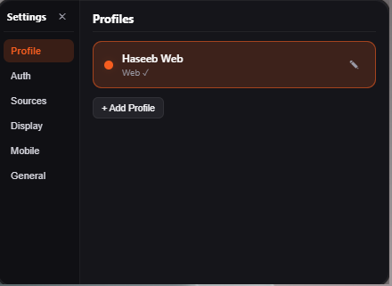
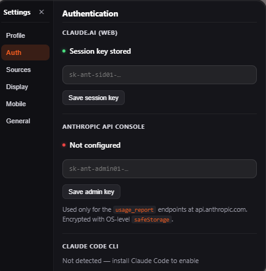
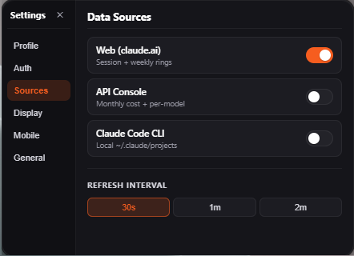
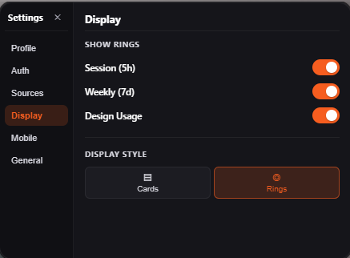
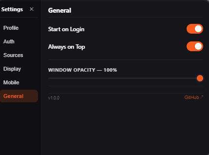

# Claude Usage Tracker for Windows and Mac OS

A floating, always-on-top desktop tracker for Claude AI usage — web, API
Console, and Claude Code CLI — with multi-profile support and a mobile
companion that pairs over your local network.

Built with Electron + React + Vite. Dark glass UI, premium-orange accent.

---

## Screenshots

### Main window

| Cards style | Rings style |
| --- | --- |
|  |  |

### Settings (sidebar)

| Profile / overview | Auth | Sources |
| --- | --- | --- |
|  |  |  |

| Display | Mobile (QR) | General |
| --- | --- | --- |
|  |  |  |

---

## Features

**Usage sources (toggle per profile)**
- **Web** — polls `claude.ai/api/organizations/{uuid}/usage` for session, weekly, and Opus utilization.
- **API Console** — month-to-date $, 30-day sparkline, top-3 models by tokens (requires an admin API key).
- **Claude Code CLI** — sums every `~/.claude/projects/**/*.jsonl`: today's input/output/cache tokens, top-3 active projects, lifetime totals. Live-updates via `chokidar`.

**Multi-profile**
- Unlimited profiles, each with its own session key + admin key + source toggles.
- Auto-generated names (`Bold Falcon`, `Quiet Otter`, …) and colors.
- Dropdown in the title bar to switch instantly.
- Credentials encrypted with Electron `safeStorage` (DPAPI on Windows, Keychain on macOS).

**Mobile companion (React Native / Expo)**
- Pair via QR — desktop runs a local HTTPS server with a self-signed cert; QR carries the cert fingerprint + a 120 s one-time token + X25519 public key.
- Phone scans, completes the handshake, then receives **encrypted** usage events over SSE (`nacl.box`).
- **Credentials never leave the desktop.** The phone only ever decrypts derived stats.
- Revoke devices from the desktop at any time.
- See [`docs/PAIRING_PROTOCOL.md`](docs/PAIRING_PROTOCOL.md) for the wire spec.

**UX**
- Auto-height window — no scrollbars, no fixed sizes.
- 300 px main view → 440 px sidebar Settings layout.
- Mini-pill mode with `Ctrl+Shift+M` (or `Cmd+Shift+M`) global shortcut.
- Always-on-top toggle, system tray entry, OS notifications at 75 / 90 / 100 %.

---

## Setup

### Desktop

```bash
npm install
npm run dev      # vite + electron
```

For a production build:

```bash
npm run dist:win   # Windows installer + portable
npm run dist:mac   # macOS dmg + zip
```

### Mobile companion

```bash
cd mobile
npm install
npx expo start
```

Open the Expo Go app on your phone and scan the dev QR (or press `i` / `a` to launch a simulator).

---

## Architecture

```
src/
  main/                              Electron main
    index.js                         BrowserWindow + global shortcuts
    ipc.js                           IPC router
    auth.js                          Claude Code CLI credentials
    tray.js                          System tray
    preload.js                       contextBridge surface
    store/
      schema.js                      Multi-profile schema + migrations
    sources/
      web.js                         claude.ai usage
      apiConsole.js                  Anthropic admin API
      cli.js                         ~/.claude/projects scanner + watcher
    pairing/
      crypto.js                      X25519 + nacl.box
      cert.js                        Self-signed TLS (cached)
      server.js                      HTTPS server + SSE stream

  renderer/                          React (Vite)
    App.jsx
    hooks/
      useAuth.js
      useProfile.js                  Profile CRUD hook
      useUsageData.js                Web polling
    components/
      UsageCard.jsx                  Web-style metric card
      RingChart.jsx                  SVG ring variant
      ApiUsageCard.jsx               API source card
      CliUsageCard.jsx               CLI source card
      SourceSwitcher.jsx             Web/API/CLI/All segmented
      MiniPill.jsx
      ProfileDropdown.jsx
      AuthWizard.jsx
      Insights.jsx
      QrPair.jsx
      Settings/
        index.jsx                    Sidebar + tab router
        SettingsSidebar.jsx
        tabs/{Profile,Auth,Sources,Display,Mobile,General}.jsx
    styles/glass.css                 Theme tokens + all component styles

mobile/                              React Native (Expo)
  App.js                             Pair / Dashboard switch
  src/
    crypto.js                        nacl.box mirror
    PairScreen.js                    Camera + QR scan + handshake
    DashboardScreen.js               SSE consumer + decrypt

docs/
  PAIRING_PROTOCOL.md                Mobile pairing wire spec

IMPLEMENTATION_PLAN.md               Phase plan
```

### Data flow

```
┌──────────┐  IPC  ┌──────────┐
│ Renderer │ ◄────►│   Main   │
└──────────┘       └────┬─────┘
                        │
              ┌─────────┼──────────┐
              ▼         ▼          ▼
         web.js   apiConsole.js   cli.js
         claude.ai  api.anthropic  ~/.claude
                                   └─ chokidar watcher

Main ──► pairing/server (HTTPS + SSE) ──► Mobile (encrypted)
```

---

## Security notes

- **Session keys and admin keys** are encrypted at rest using Electron's `safeStorage` (per-OS keychain).
- **Admin API key** is only ever sent to `api.anthropic.com` with the `x-api-key` header, only for `usage_report` / `cost_report` endpoints.
- **Mobile pairing** uses a self-signed TLS cert pinned by SHA-256 fingerprint in the QR, plus X25519 + XSalsa20-Poly1305 (`nacl.box`) on top.
- The mobile app **never** receives credentials — it only ever sees decrypted *usage stats*.
- Revoked devices have their SSE connection terminated immediately.

---

## Keyboard shortcuts

| Shortcut | Action |
| --- | --- |
| `Ctrl/Cmd + Shift + M` | Toggle mini pill |
| Double-click pill | Expand from mini |

---

## License

MIT
